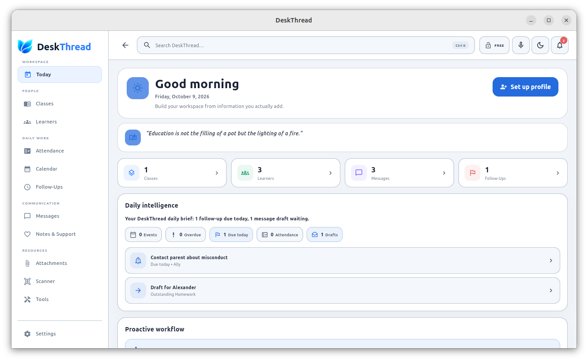
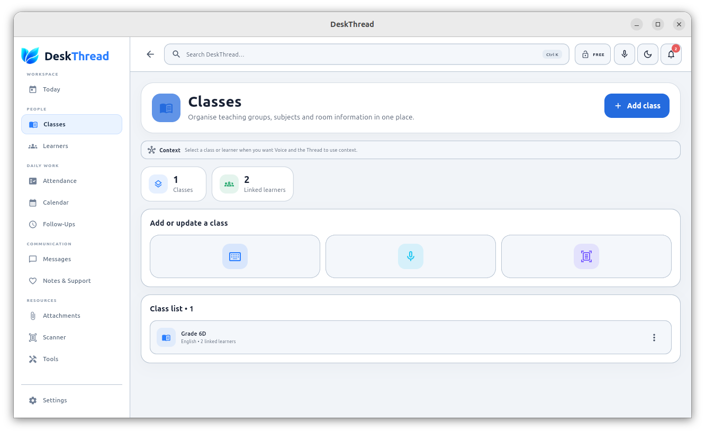
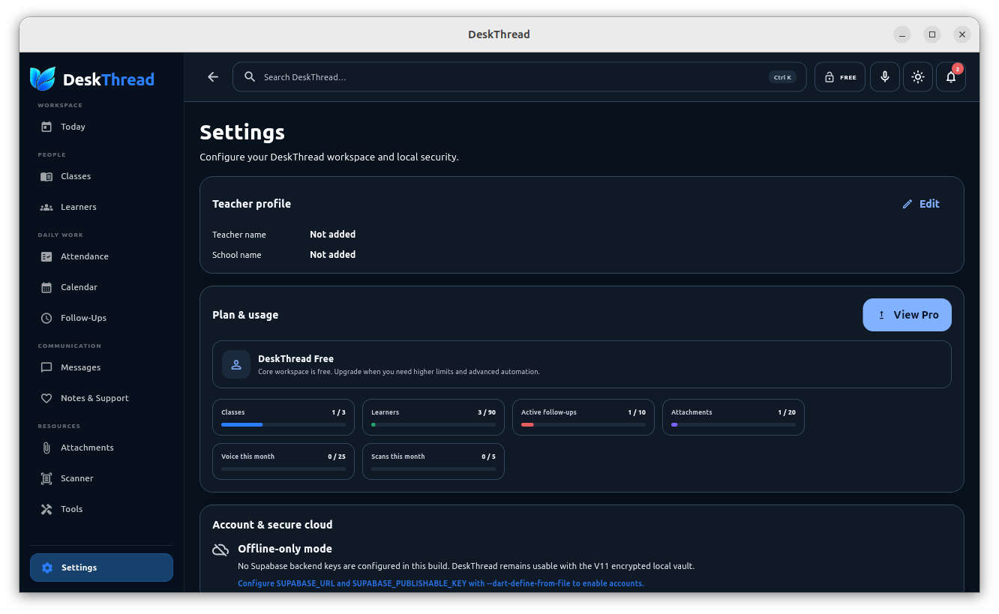

  

  <strong>A focused desktop workspace for everyday teaching.</strong>

DeskThread brings core classroom workflows into one organized application so teachers can manage classes, learners, attendance, follow-ups, communication, notes, attachments, scanning, and everyday planning from one desktop workspace.

## Download DeskThread 1.0.0

### Linux — Ubuntu / Debian

**Recommended installer**

[Download DeskThread 1.0.0 (.deb)](https://github.com/Alex3zer0/DeskThread-Releases/releases/latest/download/deskthread_1.0.0_amd64.deb)

Install:

    sudo apt install ./deskthread_1.0.0_amd64.deb

### Portable Linux x64

[Download portable Linux version](https://github.com/Alex3zer0/DeskThread-Releases/releases/latest/download/DeskThread-1.0.0-linux-x64.tar.gz)

Extract it and run:

    ./launch-deskthread.sh

### Verify your download

[Download SHA256 checksums](https://github.com/Alex3zer0/DeskThread-Releases/releases/latest/download/SHA256SUMS-linux.txt)

Verify with:

    sha256sum -c SHA256SUMS-linux.txt

## Features

- Classes and learner management
- Attendance tracking
- Calendar and events
- Follow-Ups
- Messages
- Notes & Support
- Secure attachments
- Document Scanner
- OCR-assisted workflows
- Voice capture
- Teacher tools
- Search
- Light and dark modes
- Local persistence and secure storage

## System Requirements

### Debian package

- 64-bit x86_64 / amd64 Linux
- Ubuntu or compatible Debian-based distribution
- Standard Linux desktop environment

DeskThread 1.0.0 has been built, installed, and tested on Ubuntu desktop.

### Portable version

The portable version is intended for compatible 64-bit Linux desktop systems. Compatibility may vary between distributions because Linux system libraries differ.

## Uninstall

If installed with the Debian package:

    sudo apt remove deskthread

## Screenshots

  
  

  

  <strong>Today Dashboard · Classes · Dark Mode</strong>

## Windows

The Windows x64 build and installer have been produced successfully.

Windows installation and runtime validation are being completed before the Windows download is publicly released.

## Releases

Visit the releases page for downloads and checksums:

https://github.com/Alex3zer0/DeskThread-Releases/releases

## Support

For installation or release-package problems:

https://github.com/Alex3zer0/DeskThread-Releases/issues

## Source Code

DeskThread is currently distributed as a compiled application. The application source repository remains private.

---

**DeskThread 1.0.0**

Copyright © 2026 Schroeder Appworks.

## Screenshots

### Today dashboard

### Classes

### Dark mode

